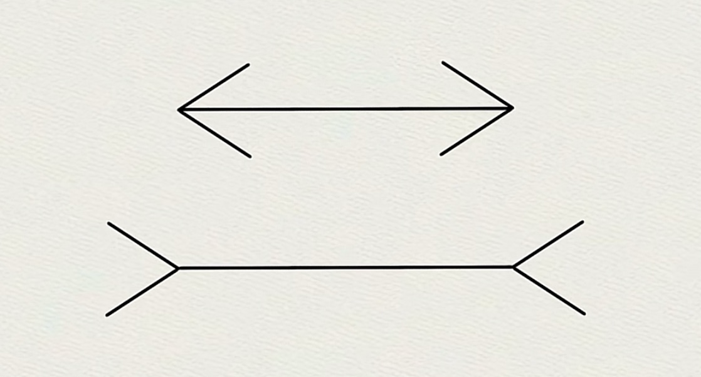
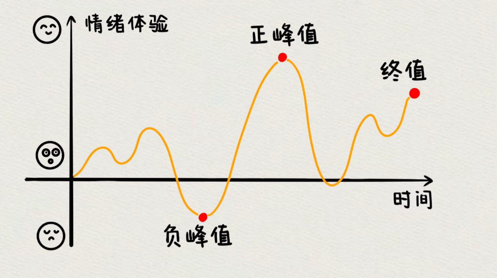

> Do you consider yourself more impulsive or more rational?

<!-- more -->

The author, Daniel Kahneman—a psychologist who stunned the world by winning the Nobel Prize in Economic Sciences in 2002—has devoted his life to exploring how we make choices and decisions under uncertainty.

This book brings together most of his research findings. Before diving into its content, let me ask you again: ***Do you consider yourself more impulsive or more rational?***

Read on, and then see if your answer holds.

## Two Systems

> It is well known that the human brain operates with two systems.

Kahneman refers to them as System 1 and System 2—in simple terms, the intuitive system and the rational system.

The book defines these two systems as follows:
- **System 1** works unconsciously and rapidly, requiring little mental effort, and operates on its own.
- **System 2** directs attention to tasks that demand significant mental exertion.

System 1 is like a robot—efficient and effortless, but a bit crude—while System 2, although more thorough and clear, is lazy, slow, and consumes a lot of energy.

When faced with challenges, System 1 steps in first; only when it finds the problem too complex does it call on System 2.

However, System 1 sometimes rushes to action by simplifying a complex issue into a neat story for System 2, which then assumes it need not intervene. 

For example, consider the two line segments in the middle of the image below. Which one appears longer to you?

I suspect most would choose the second one—even though they are actually equal in length. This is System 1’s narrative at work.

Kahneman calls this phenomenon a “heuristic” or “anchoring effect.” Once System 2 is convinced by the story System 1 has fabricated, cognitive biases begin to emerge.

_What kinds of biases might arise from this?_

## Cognitive Biases

> The book discusses dozens of biases; here are two notable examples.

### Bias 1: Prospect Theory

This is one of the core theories of the book. Let’s start with a test:

::: tip There are two boxes:
- If you open Box A, you will definitely receive 9,000 yuan.
- If you open Box B, you have a 90% chance of receiving 10,000 yuan and a 10% chance of receiving nothing.
:::

_Which would you choose: A or B?_

Now, consider another scenario:

::: tip You need to pay compensation to someone. You have two options:
- Option 1: Pay 9,000 yuan outright.
- Option 2: Enter a lottery with a 90% chance of paying 10,000 yuan and a 10% chance of paying nothing.
:::

_Which option would you choose: 1 or 2?_

From an expected value perspective, both choices should be equivalent. Yet, many of us tend to favor A over B, and option 2 over option 1. Why is that?

Because <HSentence>the pain of loss is far more intense for us than the pleasure of gain.</HSentence>

This is known as Prospect Theory, or loss aversion theory. The certainty of receiving 9,000 yuan is more appealing than the possibility of 10,000—even if their expected values are the same. This may also explain why gamblers are so desperate to win back what they've lost.

### Bias 2: The Endowment Effect

> This effect is closely linked to loss aversion.

It means that <HSentence>once a person owns something, they tend to value it more highly than they did before they owned it.</HSentence>

_For instance, imagine you are an ardent fan of a particular singer. You painstakingly save up and spend 500 yuan on a concert ticket, and you believe that the most you’d ever pay for it is about 1,000 yuan. But if someone who didn’t get a ticket offers to buy it from you, you might refuse even 1,000 yuan—only to reconsider if the offer reaches 3,000 yuan. Why does your initial valuation jump from 1,000 to 3,000?_

**Because the pain of giving it up far outweighs the pleasure of obtaining it.**

The endowment effect is common in everyday life:
- For example, homeowners might refuse to sell their property—even when prices are falling—because they once perceived its value as many times higher, even if that value was merely an illusion.
- Bidders in an auction often continue to raise their bids because, once they bid, they feel as though the item is already theirs.
- And couples who constantly argue sometimes reminisce about each other’s good qualities after separating.

There are many other examples of this phenomenon.

## The Peak-End Rule

> The final part of the book introduces a fascinating concept called the Peak-End Rule.

It posits that <HSentence left>our overall judgment of an experience—whether pleasurable or painful—is determined not by the entirety of the event, but by its peak and its ending.</HSentence>

For example:
::: tip Most of us have experienced the pain of having a tooth pulled. Now consider two scenarios:
- Plan A lasts 10 minutes with moderate pain overall, but ends with a brief, intense spike of pain.
- Plan B lasts 20 minutes with a similar level of pain throughout, but finishes gently without that harsh spike. Which would you choose?
:::

Many might opt for Plan A, thinking that enduring a shorter period of pain is preferable, even if it ends with a sharp spike. 

Yet experiments show that people recall Plan B as being significantly less painful than Plan A. Even though Plan B lasts longer, the overall memory is dominated by the gentle ending.

_So, how do we ultimately evaluate our own happiness?_

Kahneman explains that we have two selves:
- The **Experienced Self**: which feels the immediate, moment-to-moment sensations.
- The **Remembering Self**: which reflects on the experience afterward.

No matter how much joy the Experienced Self may feel during an event, if the peak and the ending are unpleasant, the overall memory will be tainted. Conversely, even if the experience is mostly painful, if its peak and ending are pleasant, we tend to remember it fondly.

_For instance, although we may have suffered greatly during our high school years, many of us still find ourselves wishing we could relive that time._

---

After finishing this book, I was struck by a sentiment reminiscent of Nassim Taleb’s observation: ***Humans are essentially no different from the monkeys of millions of years ago.***

Even though we may feel increasingly rational and wise, that feeling is merely an illusion created by System 1, while System 2 remains largely powerless in the face of it.

**Interestingly, when we fully accept that we are “just monkeys,” our minds make space for System 2 to step in, reducing many biases. Perhaps this is the greatest gift this book offers.**

Finally, to return to the question posed at the beginning: <HSentence>Do you still consider yourself a rational person?</HSentence>

<h4>Thinking, Fast and Slow</h4>

 * Author: Daniel Kahneman  
 * Publication Year: 2012  
 * Category: Personal Growth

::: right
_— From @不略_
:::

