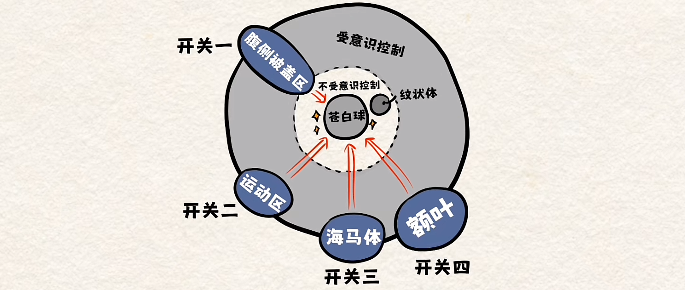

> 做事总是3分钟热度，该怎么办？

<!-- more -->

## 三分钟热度

> 喜欢吃一个东西，吃多了就腻了；喜欢学一门技能，学两天就够了；喜欢上一个人，呆久了也就烦了。

这并不是你性格的问题，而是因为人的大脑皮质天然具备一种“驯化”的功能，让我们得以适应各种环境。也就是说，三分钟热度是人的天性，它会让一件开心的事渐渐变得无趣，但同时，也就让那些让人觉得麻烦的事渐渐地得到适应。

_比如我们讨厌刷牙，但当刷牙的麻烦得到适应时，它就变成了一种习惯。_

面对大脑这种“驯化”的本能，重要的是我们怎么去利用它，让麻烦变得习以为常，当习以为常的麻烦加上能够持续一段时间的干劲，麻烦最终就能变成轻松的习惯。

而干劲的产生，由大脑的另一个构造决定：**苍白球**。

## 如何激发干劲？

> 科学家发现，当大脑中的苍白球处于活跃状态，我们就能持续地充满干劲。

但苍白球却不像我们的手脚，可以任由我们的意识操控，我们没有办法自主控制它变活跃，那么该怎么激发它呢？

脑科学家发现，操控它变得活跃的有 4 个开关，只要开启 4 个开关的其中的一个，苍白球就会被带动起来。当这样的干劲持续一段时间，行为反复一定的次数，大脑中的纹状体就能被激活，从而形成习惯回路，让人痛苦和烦躁的事就会变得简单。

## 四个开关

### **开关一：让身体动起来**

> 你有没有发现，即使你万分不想打扫卫生，当你拿起扫把抹布，自然而然就会生出一些干劲，让人停不下来；即使你十分不想工作，但往电脑前一坐，不用多久自然而然就会沉浸其中。_

这是因为身体动起来时，会让大脑的运动区开始活跃，顺带能联动苍白球活跃。

_比如你试试现在让自己假装咧开嘴微笑，有没有感觉到真的变开心了一些？_

所以越是没干劲、越是不想做一件事，就越是需要让身体先动起来，大脑就会跟着动起来。

### **开关二：换一种不同的做法**

> 上学的时候，隔一段时间老师总会安排更换座位，而换到新座位的你总是会觉得更有学习的劲头。

这和另一个联动苍白球的部位有关：**海马体**。

海马体，是大脑主管记忆的区域，当新鲜感出现，海马体就会重新活跃起来，顺带就能带动苍白球一起工作。

所以在原来的工作流程中，**时不时打破常规，换一种不同的做法，海马体就会有所反应。**

### **开关三：给予奖励**

当一个人得到奖励时，大脑腹侧被盖区就会受到刺激，苍白球就会活跃起来，所以正确地设置奖励，能够更快促进习惯的养成。

但新的奖励也会慢慢被驯化，从而需要不断提升奖励。书中分享了一个设置奖励的小办法，可以试试取消生活中某些习惯，把它们当作奖励。

_比如，你原来每天晚餐要喝一罐可乐，但如果当天运动目标未完成，就不允许自己喝可乐。_

### **开关四：沉浸其中**

有一个现象叫做“吊桥效应”，是说当两个人同时经过一条颤颤巍巍的吊桥时，他们不由得会紧张到心跳加速，大脑会误将这种紧张刺激的感受，归因于自己喜欢上了对方。

也就是说，某个事件引发了大脑的波动，但大脑却时常识别错误，把原因简单归因于别的事件。

_比如体育赛事现场观众，或者拉拉队的欢呼加油声，能够越过运动员的自主意识，让他们的苍白球活跃，从而激发干劲。_

日常生活中，做一件事之前，试试让自己沉浸于幻想做完这件事带来的各种奖励中，就能骗过大脑，让它觉得这件事很有意思。

---

这套《考试脑科学》一共三本，第三本很特别，用漫画体的形式把原本枯燥的脑科学，变得非常有趣易懂，十分适合家长和孩子们一起阅读。

这次来自第三本中的内容，这一本的后半部分还针对了四个开关，分享了16个实用的小技巧，感兴趣的可以读一读。

最后，分享书里的一段话结束今天的阅读：

<HSentence>
不是先有干劲才举起拳头， 
而是先举起拳头才感觉来了干劲， 
“干劲”需要我们主动前去迎接。
</HSentence>

::: right
_——《考试脑科学3》_
:::

<h4>《考试脑科学3》</h4>

 * 作&emsp;者：[日]池谷裕二
 * 翻&emsp;译：陈庆祥
 * 出版年：2024.4
 * 分&emsp;类：认知成长（科学科普）

::: right
_——来自 @不略_
:::

